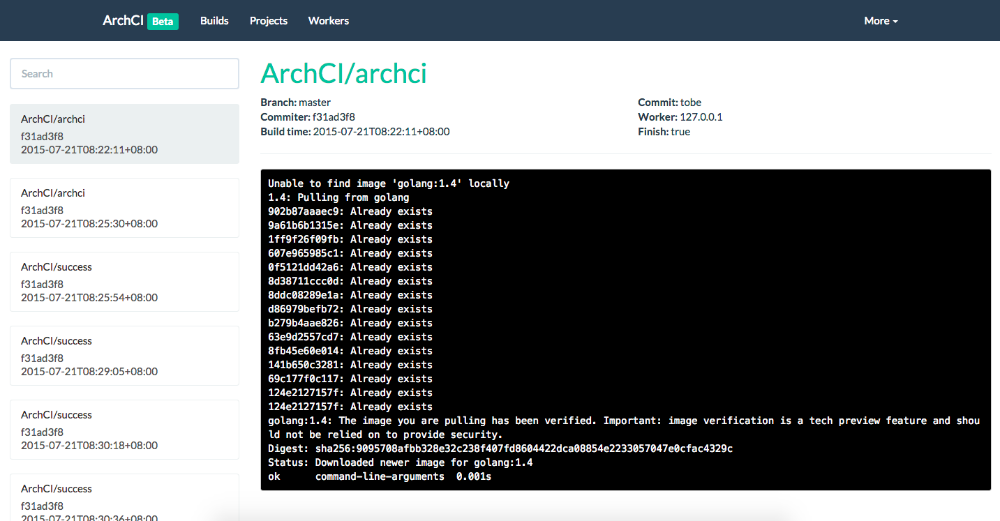

# ArchCI

## Introduction

**ArchCI** is the distributed scalable continues integration service with docker.

* Base on light-weight docker containers
* Provide RESTful APIs and command-line tool
* Support `.archci.yml` for continues integration
* 100% open-source, 100% golang and 100% docker

## Componenets

Worker: [simple-worker](https://github.com/ArchCI/simple-worker), [kubernetes-worker](https://github.com/ArchCI/kubernetes-worker)

Client: [aci](https://github.com/ArchCI/aci)

Document: [docs](https://github.com/ArchCI/docs), [slides](http://slides.com/tobychan/archci)

Docker: [docker-distribution](https://github.com/ArchCI)

## Usage

```
sudo docker run -d --net=host archci/archci
```

* `MYSQL_SERVER` is optional to set address of MySQL(DEFAULT: "")
* `MYSQL_USERNAME` is optional to set MySQL username(DEFAULT: root)
* `MYSQL_PASSWORD` is optional to set user's password(DEFAULT: root)
* `MYSQL_DATABASE` is optional to set MySQL database(DEFAULT: mysql)
* `REDIS_SERVER` is optional to set address of redis(DEFAULT: 127.0.0.1:6379)

## Screenshots



## Github Integration

You can add this in your repo's webhook.

```
http://121.201.52.197:10010/v1/hook/github/push
```

## Gitlab Integration

You can add this in your repo's webhook.

```
http://121.201.52.197:10010/v1/hook/gitlab/push
```

## Development

Refer to ArchCI documentation <http://archci.com:8000>.