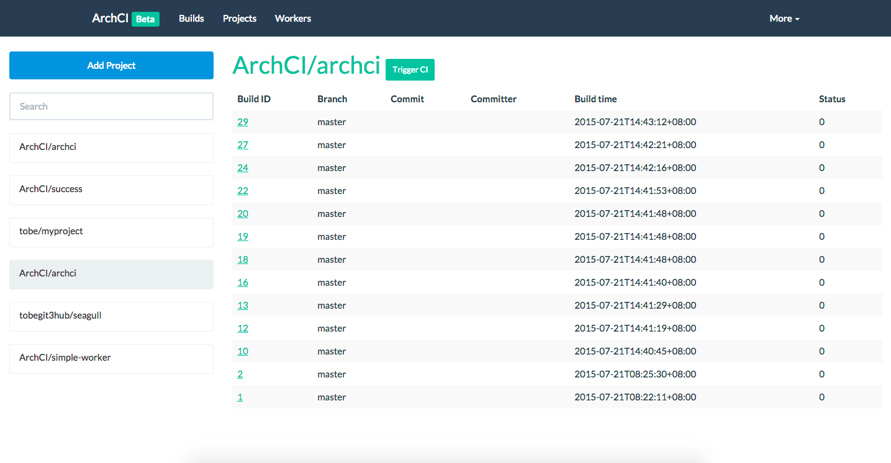

# ArchCI

## Introduction

**ArchCI** is the distributed scalable continues integration service with docker.

* Base on light-weight docker containers
* Provide RESTful APIs and command-line tool
* Support `.archci.yml` for coninues integration
* 100% open-source, 100% golang and 100% docker

## Componenets

Worker: [simple-worker](https://github.com/ArchCI/simple-worker), [kubernetes-worker](https://github.com/ArchCI/kubernetes-worker)

Client: [aci](https://github.com/ArchCI/aci)

Document: [docs](https://github.com/ArchCI/docs), [slides](http://slides.com/tobychan/archci)

Docker: [docker-distribution](https://github.com/ArchCI)

## Usage

```
docker run -d --net=host archci/demo
```

To add CI for your projects, please go to <127.0.0.1:10010>.

## Screenshots




## Development

Refer to ArchCI documentation <http://archci.com:8000>.